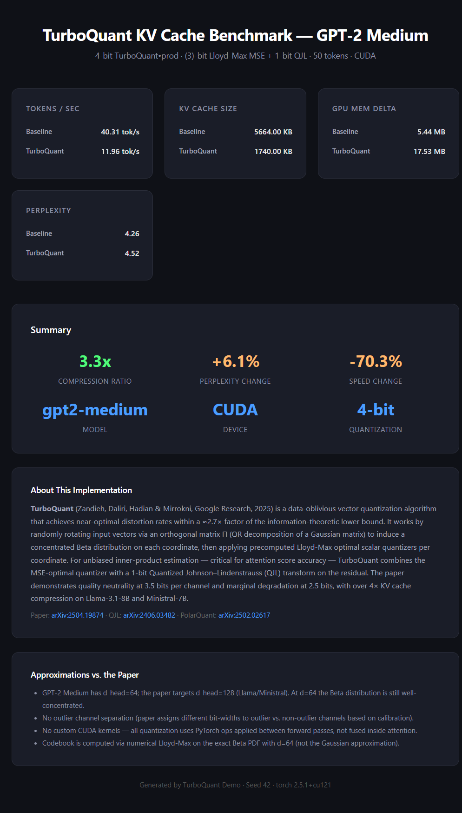
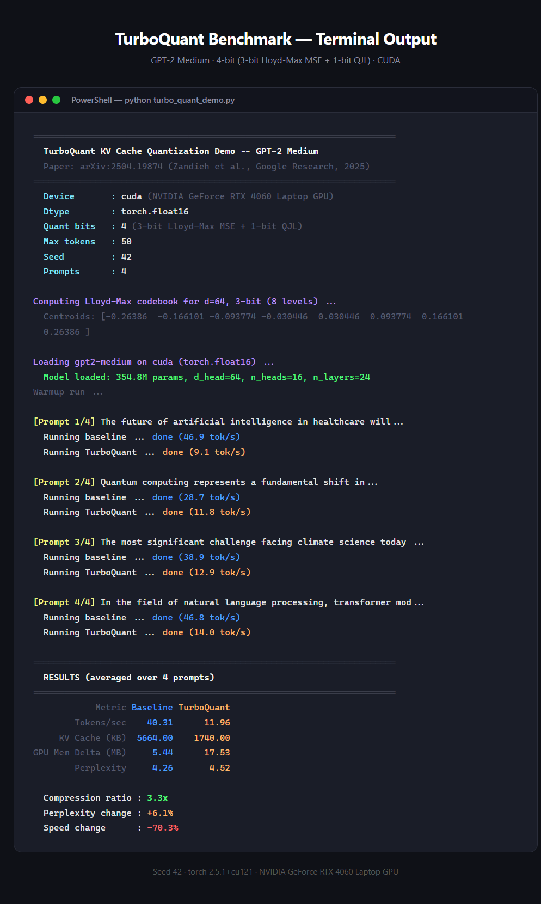

# TurboQuant KV Cache Demo — GPT-2 Medium

A faithful PyTorch implementation of **TurboQuant** (Zandieh, Daliri, Hadian & Mirrokni, Google Research, 2025) applied to KV cache compression during autoregressive generation on GPT-2 Medium.

> **Paper:** [arXiv:2504.19874](https://arxiv.org/abs/2504.19874) — *Online Vector Quantization with Near-optimal Distortion Rate*

---

## Results





---

## Key Numbers

| Metric | Baseline (fp16) | TurboQuant (4-bit) |
|---|---|---|
| Tokens / sec | 40.31 | 11.96 |
| KV Cache size | 5664 KB | 1740 KB |
| GPU Mem delta | 5.44 MB | 17.53 MB |
| Perplexity | 4.26 | 4.52 |
| **Compression ratio** | — | **3.3×** |
| **Perplexity change** | — | **+6.1%** |

Hardware: NVIDIA GeForce RTX 4060 Laptop GPU · torch 2.5.1+cu121 · GPT-2 Medium (354.8M params)

---

## Algorithm

TurboQuant is a two-stage data-oblivious vector quantizer:

**Stage 1 — TurboQuant_mse (Algorithm 1)**  
Randomly rotates input vectors via an orthogonal matrix Π (QR of a Gaussian) to induce a concentrated Beta distribution on each coordinate, then applies a precomputed **Lloyd-Max optimal scalar quantizer** per coordinate. This minimizes per-coordinate MSE.

**Stage 2 — TurboQuant_prod (Algorithm 2)**  
Computes the quantization residual `r = x − DeQuant_mse(x)`, then applies a **1-bit Quantized Johnson–Lindenstrauss (QJL)** transform `sign(S · r̂)` to the normalized residual. The combined dequantization is:

```
x̃ = DeQuant_mse(idx, ‖x‖) + γ · √(π/2)/d · Sᵀ · qjl_signs
```

This produces an **unbiased inner-product estimator** — critical for accurate attention scores without systematic bias.

The paper proves TurboQuant achieves distortion within **≈2.7×** of the information-theoretic lower bound.

---

## Files

| File | Description |
|---|---|
| `turbo_quant_demo.py` | Full implementation: Lloyd-Max codebook, TurboQuantMSE, TurboQuantProd, KV cache, benchmarking |
| `results.html` | Interactive benchmark dashboard |
| `terminal_log.html` | Styled terminal output view |
| `results.json` | Raw benchmark data (per-prompt + averages) |
| `2504.19874v1.pdf` | TurboQuant paper |
| `2406.03482v2.pdf` | QJL paper (Zandieh et al., 2024) |
| `2502.02617v1.pdf` | PolarQuant paper (companion work) |

---

## How to Run

```bash
python -m venv venv
# Windows
venv\Scripts\activate
# macOS/Linux
source venv/bin/activate

pip install torch --index-url https://download.pytorch.org/whl/cu121
pip install transformers accelerate numpy pandas psutil

python turbo_quant_demo.py
```

Outputs `results.json` and `results.html` in the same directory.

---

## Approximations vs. the Paper

- **d_head = 64** — GPT-2 Medium has d_head=64; the paper targets d_head=128 (Llama/Ministral). At d=64 the Beta distribution is still well-concentrated and the algorithm works correctly.
- **No outlier channel separation** — the paper assigns different bit-widths to outlier vs. non-outlier channels based on calibration data.
- **No fused CUDA kernels** — quantization is applied between forward passes via PyTorch ops rather than fused inside the attention mechanism, which explains the throughput overhead.
- **Codebook** is computed via numerical Lloyd-Max iteration on the exact Beta PDF with d=64 (80k grid points, 300 iterations).

---

## Related Papers

- **QJL** — [arXiv:2406.03482](https://arxiv.org/abs/2406.03482): 1-bit Quantized JL Sketch for KV Cache
- **PolarQuant** — [arXiv:2502.02617](https://arxiv.org/abs/2502.02617): KV cache quantization via polar coordinate decomposition
